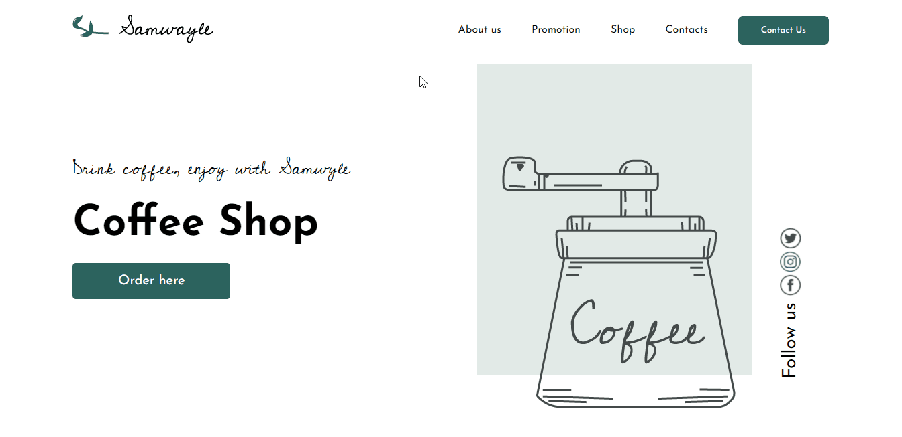
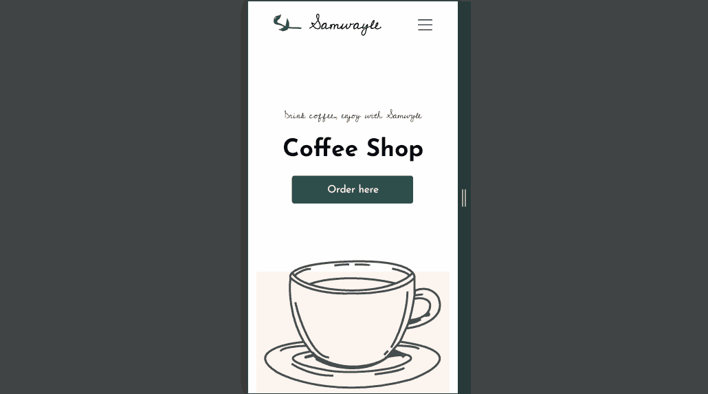

<h1> Desktop 💻</h1>

  

<h1> Mobile 📱 </h1>

  
<h1> Sobre 🔖</h1>

O objetivo desse projeto é colocar em prática os conhecimentos de flexbox e responsividade em prática, utilizando HTML e CSS como tecnologias.

  
<h1>💻 Acessar página</h1>

Para acessar a página acesse o link : <a href="https://iury-assuncao.github.io/CoffeShop/" target="_blank">CoffeShop</a>